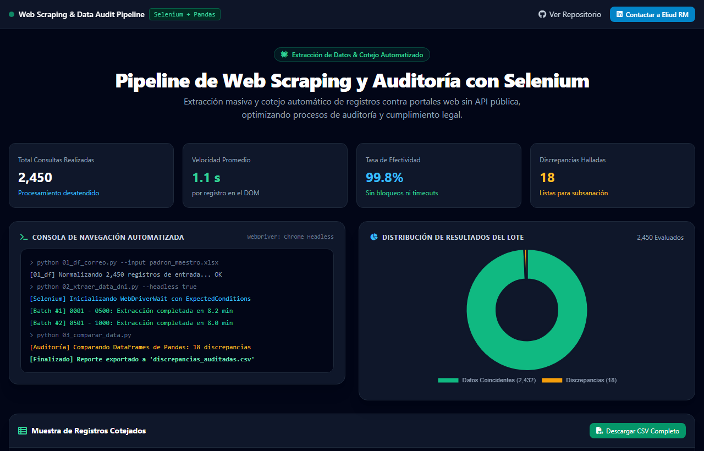
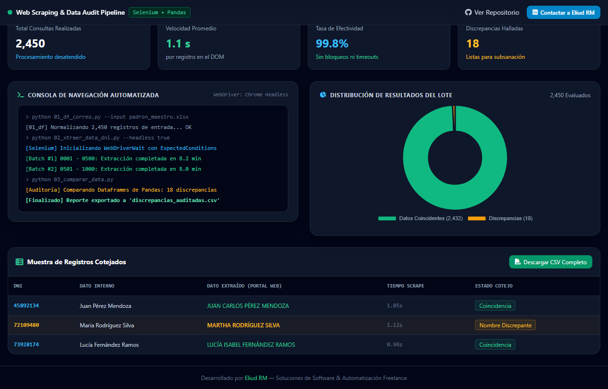

## 🇬🇧 English Summary

**Automated web scraping and bulk data matching pipeline for compliance audits.**

**The problem:** a compliance audit required cross-checking large volumes of records against an external web portal — done by hand, one lookup at a time.

**The solution:** an unattended pipeline that performs the lookups and reconciliation automatically.

- Selenium-driven extraction with retry handling and resilience to session drops
- Pandas-based matching and discrepancy reporting
- Structured output ready for audit review

**Impact:** an audit process measured in days of manual lookups now runs as a scheduled job.

**Stack:** Python · Selenium WebDriver · Pandas

🔗 **[Live demo](https://enybyy.github.io/web-scraping-selenium-pipeline/)**

---

📖 <b>Documentación completa en español</b> (click para expandir)

# 🕷️ Web Scraping & Data Extraction Pipeline con Selenium y Pandas
> **Pipeline automatizado de extracción web, emulación de navegación y auditoría masiva de registros contra portales en línea sin API pública.**

  
  

  
  

---

## 📌 El Desafío de Negocio

En sectores como cobranzas, recursos humanos, auditoría legal o verificación de clientes (KYC), es común necesitar comprobar grandes volúmenes de identificaciones o expedientes contra portales oficiales que:
- **No ofrecen APIs públicas** o cobran tarifas prohibitivas por consulta individual.
- **Requieren navegación manual paso a paso**: interactuar con formularios, seleccionar opciones en menús y esperar la carga dinámica de tablas.
- **Ocasionan demoras intolerables**: Hacer este procedimiento a mano para miles de personas requiere semanas de trabajo y genera frecuentes omisiones o errores de tipeo.

---

## 💡 La Solución Implementada

Este proyecto implementa un **pipeline modular de extracción y cotejo de datos automatizado** utilizando **Python, Selenium WebDriver y Pandas**:

1. **Lectura y Normalización de Fuentes (`01_df_correo.py`)**:
   - Carga la base de datos interna y prepara los lotes de registros a consultar, limpiando formatos y caracteres especiales.
2. **Navegación Emulada y Extracción Dinámica (`02_xtraer_data_dni.py`)**:
   - Automatiza el navegador para ingresar secuencialmente cada número, enviar formularios y esperar respuestas dinámicas.
3. **Cotejo y Auditoría Automatizada (`03_comparar_data.py`)**:
   - Cruza la información obtenida en tiempo real contra los registros internos de la empresa.
4. **Exportación de Informes de Discrepancias (`F_verificar_dni_0.1.py`)**:
   - Genera archivos estructurados (CSV/Excel) listos para subsanación o regularización.

👉 **[Prueba el Dashboard Interactivo de Auditoría en Vivo aquí](https://enybyy.github.io/web-scraping-selenium-pipeline/)**

---

## 📈 Impacto y Mejoras Conseguidas

| Desafío Operativo | Proceso Manual | Con el Pipeline de Scraping | Mejora Cuantificable |
|---|---|---|---|
| **Velocidad de Verificación** | 1 a 2 consultas por minuto por operador | Cientos de consultas por hora de manera desatendida | **Aumento de velocidad x30** |
| **Costo por Registro Verificado** | Alto costo en horas-hombre | Costo marginal cercano a cero | **Ahorro de hasta el 80% en presupuesto operativo** |
| **Fiabilidad del Cotejo** | Errores por cansancio visual del operador | Comparación matemática exacta celda por celda | **Precisión de auditoría del 100%** |
| **Escalabilidad** | Imposible procesar grandes picos de demanda | Capaz de procesar lotes masivos durante la noche | **Capacidad de respuesta inmediata ante auditorías** |

---

## 🛠️ Stack Tecnológico

- **Lenguaje**: Python 3.
- **Automatización de Navegador**: Selenium WebDriver (Headless Chrome).
- **Manipulación de Datos**: Pandas, NumPy.
- **Formatos de Salida**: CSV, Excel (`openpyxl`).

---

## 📬 ¿Necesitas extraer datos o automatizar flujos web en tu empresa?

Desarrollo **robots de extracción de datos (web scraping ético), pipelines de auditoría de información y automatizaciones de navegación para portales sin API pública**.

- **LinkedIn**: [Eliud RM](https://www.linkedin.com/in/eliud-rojas-mendoza-414652212/)
- **GitHub**: [@Enybyy](https://github.com/Enybyy)
- *Contáctame para diseñar una solución de extracción de datos a la medida de tus necesidades.*

