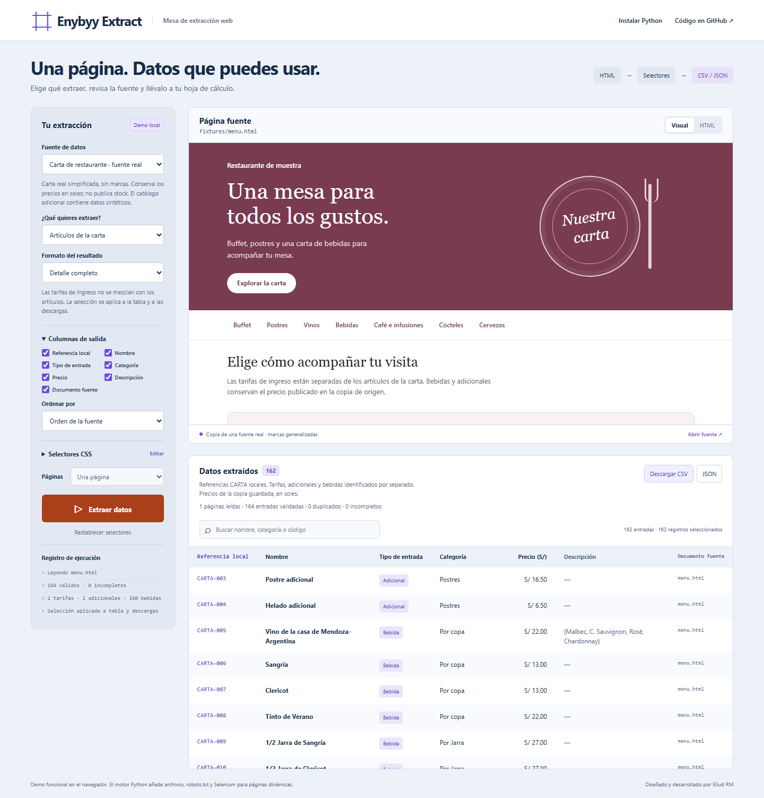
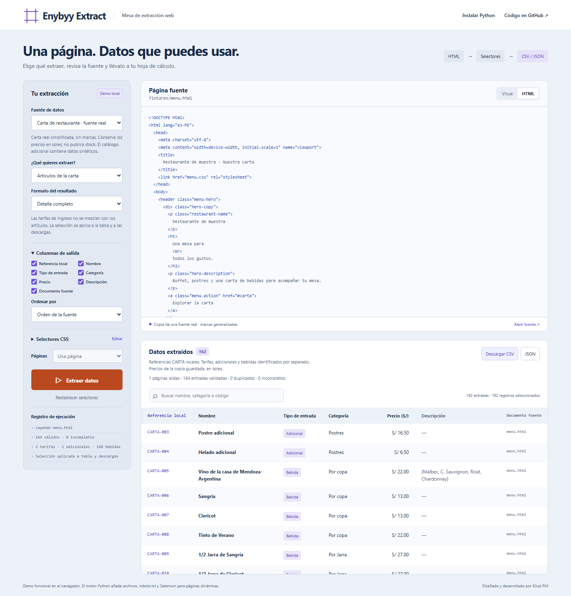
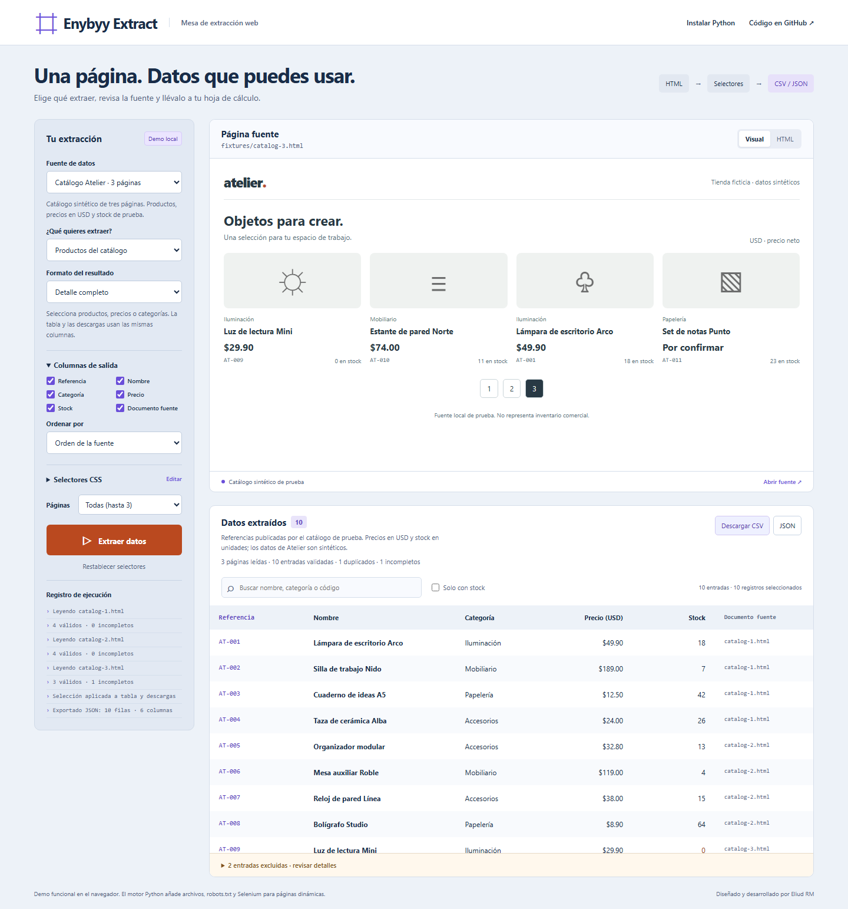

<div align="center">

# Enybyy Extract

From an HTML page to a working table: extract a restaurant menu, select fields and export CSV or JSON.

<a href="https://enybyy.github.io/web-scraping-selenium-pipeline/"></a>

<p><a href="https://github.com/Enybyy"></a>
<a href="https://www.linkedin.com/in/eliud-rojas-mendoza-414652212/"></a>
<a href="https://www.upwork.com/freelancers/~01471ca462b236e8e5"></a></p>

[](https://enybyy.github.io/web-scraping-selenium-pipeline/)

*Actual extraction screenshot using an adapted local copy. The source is not a live query.*

[About](#about-the-project) · [Workflow](#everyday-workflow) · [Technology](#built-with) · [Run locally](#local-use)

</div>


## About the project

A menu or catalog can be easy to read on screen and difficult to reuse as a table. Enybyy Extract keeps the source page visible while extracting its entries and lets users choose which fields reach the working file.

The same extraction can become item details, a price list or a category summary. Filters, columns and sorting carry into CSV and JSON, so the output corresponds to the reviewed selection. The demo uses saved sources; the Python version adds command-line execution and optional Selenium browser processing.

## Everyday workflow

| Inside the project | Detail |
| --- | --- |
| Source page | Saved source view and indented HTML. |
| Extraction | CSS selectors applied to the document, with fields and source per record. |
| Output selection | Items, rates, columns, categories and result order. |
| Working formats | Details, price list or category summary; CSV and JSON. |
| Console and browser | Python workflow and optional Selenium execution. |

## Screenshots

### Source HTML and its tags



### Additional catalog for pagination testing



## The example source

`fixtures/menu.html` is a simplified copy of the real menu file provided for this project. It preserves **164 entries**, prices in Peruvian soles and descriptions. The adaptation removes 44 responsive duplicates, restaurant and beverage branding, scripts, trackers, external resources and page-builder code. Commercial names are replaced with generic names. Codes such as `CARTA-001` are local example identifiers, not restaurant-issued codes.

The menu keeps its restaurant-style layout. The **HTML** tab shows two-space indentation and highlighted tags. CSS selectors extract the actual HTML content; results are not an embedded, precomputed table. The saved copy is a snapshot, with no claim that prices are current or fetched live.

The menu extracts `sku`, `name`, `category`, `price`, `description`, `record_type` and `source`, without inventing stock. Empty descriptions remain empty. Filter results and download only the visible records. A synthetic three-page Atelier catalog is also included to test pagination, duplicates, stock and incomplete entries.

## Choose what to extract

Scope depends on the source. The menu contains **2 buffet admission rates**, **2 extras** and **160 beverages**. By default it shows **162 items**; adult and child admission appear only under the buffet-rate or all-records scope, explicitly classified. Types were added to the saved copy from the original sections, not supplied as original restaurant metadata. The catalog contains 10 products with stock and USD prices.

Both sources support **full details**, **price lists** and **category summaries**. Summaries calculate entry count and minimum/maximum prices for the current selection. Choose output columns and sort by name, price or category. The table, CSV and JSON use the same selection; selectors and currency update when switching sources. Downloads are disabled when no columns are selected.

The full source is extracted and validated before scope, filters and columns are applied. Hiding the price column does not skip price validation. The command line uses the same rules:

```powershell
# Menu items, excluding admission rates (default)
.venv\Scripts\python pipeline.py
# Adult and child admission rates
.venv\Scripts\python pipeline.py --scope rates
# All records with an explicit type
.venv\Scripts\python pipeline.py --scope all
# Price list with only name and price
.venv\Scripts\python pipeline.py --format prices --fields name,price
# Group items by category
.venv\Scripts\python pipeline.py --format categories
```

## Selectors and Selenium

`schema.json` configures the menu; `catalog-schema.json` configures the synthetic catalog. Field selectors are relative to each entry.

```powershell
# The same menu using headless Chrome and an explicit wait
.venv\Scripts\python pipeline.py --browser
# Additional catalog: 3 pages, 10 records, 1 duplicate, 1 incomplete entry
.venv\Scripts\python pipeline.py --source "file:///C:/path/web-scraping-selenium-pipeline/fixtures/catalog-1.html" --schema catalog-schema.json
# Your own local copy (absolute URI)
.venv\Scripts\python pipeline.py --source "file:///C:/data/menu.html" --schema schema.json
```

Replace example paths with absolute `file:///` URIs pointing to your files. Selenium requires Chrome; Selenium Manager may need an internet connection to resolve its driver. The browser also closes after errors.

HTTP sources require `--allow-network`, an adapted schema and readable `robots.txt`. The CLI limits page count and size, rejects cycles and pagination outside the initial origin or folder. Prices use decimal points; CSV preserves Unicode and neutralizes formula prefixes. Pasted HTML is parsed without executing scripts. The static demo runs in the browser; Python and Selenium run from the console.

## Built with

| Area | Technology |
| --- | --- |
| Demo | HTML, CSS and JavaScript |
| Local extraction | Python and CSS selectors configured in JSON |
| Optional browser | Selenium and Chrome |
| Output | CSV and JSON |
| Verification | unittest and Playwright |

## Local use

<details>
<summary><strong>Run on your computer</strong></summary>

Python 3.10+ is required.

```powershell
git clone https://github.com/Enybyy/web-scraping-selenium-pipeline.git
cd web-scraping-selenium-pipeline
python -m venv .venv
.venv\Scripts\python -m pip install -r requirements.txt
.venv\Scripts\python pipeline.py
.venv\Scripts\python -m http.server 5083 --bind 127.0.0.1
```

Open [localhost:5083](http://localhost:5083) and select **Extraer datos** (Extract data). The console writes `output/catalog.csv` and `output/report.json`.

</details>

<details>
<summary><strong>Verification</strong></summary>

```powershell
.venv\Scripts\python -m unittest discover -s tests -v
npm install
npx playwright install chromium
# With the server on port 5083 running:
npm test
```

Tests cover the menu, additional catalog, exports, selectors, formatted HTML and responsive layout. See [verification notes](docs/verification.md).

</details>

---

<div align="center">

**Eliud Rojas Mendoza · Enybyy**

<p><a href="https://github.com/Enybyy"></a>
<a href="https://www.linkedin.com/in/eliud-rojas-mendoza-414652212/"></a>
<a href="https://www.upwork.com/freelancers/~01471ca462b236e8e5"></a></p>

</div>
