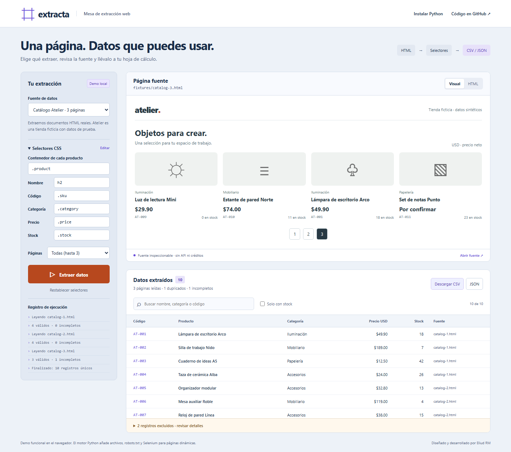

# Extracta

Extrae catálogos HTML con selectores CSS, recorre páginas, valida los registros y exporta CSV o JSON con su procedencia.



[Abrir demo web](https://enybyy.github.io/web-scraping-selenium-pipeline/) · [Imagen para Upwork, 4:3](assets/screenshots/extracta-upwork-4x3.png) · [Vista móvil](assets/screenshots/extracta-mobile.png)

**English:** A working catalog extraction workbench with editable CSS selectors, real HTML pagination, duplicate detection, validation, and CSV/JSON exports. The browser demo extracts a clearly labeled synthetic catalog; the Python CLI supports local files, HTTP sources and Selenium-rendered pages.

## Instalar y ejecutar

Requiere Python 3.10 o posterior. La demo web funciona con un servidor estático; no necesita claves ni dependencias de JavaScript.

```powershell
git clone https://github.com/Enybyy/web-scraping-selenium-pipeline.git
cd web-scraping-selenium-pipeline
python -m venv .venv
.venv\Scripts\python -m pip install -r requirements.txt
.venv\Scripts\python pipeline.py
.venv\Scripts\python -m http.server 5083 --bind 127.0.0.1
```

Abre [localhost:5083](http://localhost:5083). En macOS/Linux reemplaza `.venv\Scripts\python` por `.venv/bin/python`.

La extracción de consola escribe `output/catalog.csv` y `output/report.json`. Usa `--output otra-carpeta` para cambiar el destino.

## Probar la mesa de extracción

1. Pulsa **Extraer datos**. Se leen los archivos de `fixtures/`, siguiendo el enlace HTML `rel="next"`.
2. Compara la página fuente con la tabla. La pestaña **HTML** permite inspeccionar el documento que se leyó.
3. Filtra por nombre, categoría o código; activa **Solo con stock**.
4. Descarga CSV o JSON. El archivo contiene los registros visibles después de aplicar los filtros. JSON incluye también las páginas y el informe de exclusiones.
5. Cambia un selector o selecciona **Pegar mi propio HTML** para usar otro documento. El HTML pegado se analiza como texto; sus scripts no se ejecutan.

El resultado del catálogo incluido es reproducible: **3 páginas, 10 productos únicos, 1 duplicado y 1 registro con precio incompleto**. Hay 12 tarjetas de origen, una de ellas repite `AT-001`; `AT-011` no publica precio y se excluye. `AT-009` tiene stock cero y sigue siendo un registro válido.

Atelier es una tienda ficticia con datos sintéticos y precios de ejemplo en USD. La extracción, los filtros y los archivos descargados funcionan de verdad. La demo estática no consulta sitios externos ni ejecuta Python/Selenium: eso corresponde a la CLI. No presenta métricas de productividad, clientes o resultados comerciales sin evidencia.

## Adaptar la extracción en Python

Los campos del catálogo son `sku`, `name`, `category`, `price` y `stock`; sus selectores y el enlace de paginación viven en `schema.json`. Ajusta ese archivo a la estructura de tu catálogo. Los selectores de los campos son relativos al contenedor de cada producto.

```powershell
# Otro archivo local y un esquema adaptado
.venv\Scripts\python pipeline.py --source "file:///C:/datos/catalogo.html" --schema schema.json --max-pages 5

# Página dinámica: Chrome headless con espera explícita al contenedor
.venv\Scripts\python pipeline.py --browser

# Fuente HTTP autorizada: acceso explícito, robots.txt y pausa entre páginas
.venv\Scripts\python pipeline.py --source "https://tu-dominio.example/catalogo" --schema schema.json --allow-network --delay 2 --max-pages 5
```

Selenium requiere Chrome; Selenium Manager resuelve el controlador y puede necesitar conexión en la primera ejecución. El código cierra el navegador incluso si hay un error.

La CLI permite hasta 50 páginas, detecta ciclos, conserva la primera aparición de cada código y registra las exclusiones. La paginación se limita al origen inicial; con archivos locales, a la carpeta inicial. Las peticiones HTML tienen timeout y límite de 2 MB. Para fuentes HTTP, una lectura fallida o una prohibición en `robots.txt` detiene la ejecución. No incluye evasión de bloqueos ni consultas de identidad.

## Validación y límites

Nombre y código son obligatorios. El precio admite punto decimal y coma de miles (`$1,234.50`); el stock admite enteros no negativos. Si necesitas precios con coma decimal, modifica `price_number` y `parsePrice` antes de usar esa fuente. CSV conserva Unicode, cita comas/comillas y neutraliza prefijos de fórmula.

Las pruebas cubren la fuente local y la lógica de extracción. La integración de un sitio externo necesita un esquema específico y su propia verificación; no se ha validado un servicio de producción. Los cambios de estructura del sitio pueden requerir nuevos selectores. No hay programación de tareas, autenticación ni persistencia histórica.

```powershell
.venv\Scripts\python -m unittest discover -s tests -v
```

Para las pruebas de navegador y regenerar las capturas (Node.js 20 o posterior):

```powershell
npm install
npx playwright install chromium
# Mantén el servidor del puerto 5083 activo en otra terminal
npm test
```

Se verificaron el motor HTML, el modo Selenium sobre la misma fuente y el flujo web completo. El informe de revisión está en [docs/verification.md](docs/verification.md).

## Un repositorio, un proyecto

```text
index.html / app.css / app.js   Mesa web estática
pipeline.py / schema.json      Motor Python y configuración
fixtures/                      Catálogo reproducible de 3 páginas
tests/                         Pruebas del motor y navegador
assets/screenshots/            Capturas reales de escritorio, móvil y Upwork
docs/                          Diseño, revisión y cambios frente al código anterior
```

Se reemplazaron los scripts antiguos de DNI y sus rutas personales por una herramienta de extracción de catálogos. Las consultas de identidad pertenecen al proyecto independiente de validación de DNI.

Desarrollado por [Eliud Rojas Mendoza](https://github.com/Enybyy). Licencia MIT.
